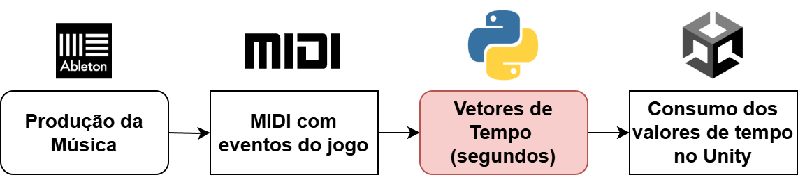
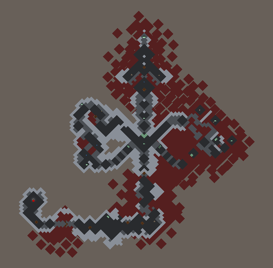
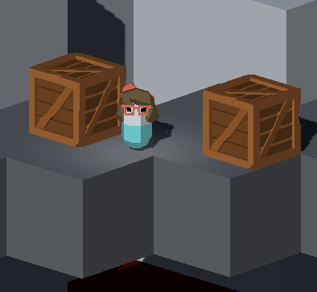
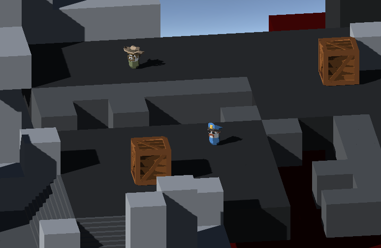

# Ludomusicalidade: Projeto de Tese de Conclusão de Curso (TCC)

### Engenharia de Computação PCS - POLI-USP 
#### Gabriel Yugo Nascimento Kishida -- 2024

Um projeto de jogo 3D que implementa conceitos lúdicos e musicais, estudando como sua interação agrega a jogos virtuais.

**[Acesse o Projeto no Itch.io para testar!](https://kaliyahk.itch.io/ludomusicality)**

**[Responda ao formulário!](https://docs.google.com/forms/d/e/1FAIpQLSfH9ZPZbz_TqATdVDDEiOEP0lwxCjFRcUZ0TjtLhLTP_FQUyQ/viewform?usp=sf_link)**

----
## Motivação

A **indústria de jogos** tem desempenhado um papel crucial na sociedade contemporânea, tanto como uma forma de entretenimento quanto uma plataforma para a expressão artística e cultural. Com a evolução tecnológica e a crescente demanda por experiências cada vez mais imersivas, os desenvolvedores de jogos têm explorado diversas formas de aprimorar a interação entre o jogador e o ambiente virtual. Um aspecto que se destaca neste meio é a **integração da música** como elemento essencial na experiência de jogo.

Como diz a compositora **Winifred Phillips** em seu livro ***A Composer's Guide to Game Music***: 

>A **música** é um **elemento de jogabilidade** como qualquer outro. Ela tem o poder de guiar os jogadores, fornecer feedback e melhorar a imersão ao conectar diretamente as emoções à experiência.

A **Ludomusicalidade** – palavra que une conceitos **lúdicos** de mecânicas na jogabilidade com **musicalidade** – busca dar o próximo passo, colocando a música não só como um elemento que fornece feedback ao jogador, mas como uma entidade ativa que rege as regras do jogo. O intuito deste projeto é estudar este caso de um **ponto de vista de engenharia**: como a aplicação destas mecânicas pode ser facilitada tanto para o compositor quanto para o desenvolvedor. Desta forma, busca-se aplicar conceitos de ***Engenharia de Software*** para desenvolver **estruturas e arquiteturas** úteis no meio de ***Game Development***. 

## Objetivo

Este Projeto de Formatura consiste no desenvolvimento de um **protótipo de um jogo eletrônico** para o computador cuja mecânica principal gira em torno da **sincronização dos comandos** do jogador com a **música do jogo**.

O objetivo deste projeto é explorar como **maneiras inovadoras** de **mecânicas de interação sincronizadas com música** podem gerar um valor de entretenimento diferenciado em uma indústria tão recente e inovadora quanto a de jogos eletrônicos. Além disso, almeja-se aplicar conceitos de engenharia e Gestão de Software para garantir que o projeto dê fruto a um produto de qualidade e que gere valor. Por fim, pretende-se adquirir e documentar o conhecimento do *engine* **Unity**, de forma a torná-lo mais acessível ao meio acadêmico.

O método utilizado para fazer isso foi adotando um *workflow* que utiliza tanto das ferramentas usadas por compositores (**Ableton Live** e arquivos **MIDI**) quanto programas desenvolvidos pelo aluno em **Python**.

Fig1: Imagem representativa do fluxo adotado.
## Resultados

O resultado do projeto foi uma fase de duração de aproximadamente 10 a 15 minutos. O jogo conta com diversas mecânicas -- para destacar algumas:

- **Sincronização musical** dos **eventos** do jogo;
- Mecânicas de **movimentação**;
- Mecânicas de **câmera**;
- **Interações com objetos** (alavancas e caixas);
- **Inimigos** com comportamento "inteligente".

Para montar esta fase-teste, foram utilizados **assets** (modelos 3D e texturas) que foram fornecidas pelo plano estudantil da **Unity**, do estúdio **Synty Studios**. Após um planejamento de como seria a fase, sua montagem foi feita utilizando conceitos de *Level Design* como o **flow area** (método para engajamento de jogadores) e **prospect & refuge** (conceito para desenvolvimento de espaços de segurança e perigo para o jogador).

Fig2: Captura de tela de uma visão do mapa

Fig3: Imagem do avatar do jogador

Fig4: Captura de tela de uma das regiões do jogo

-------
Após a montagem da fase, foi realizada uma etapa de **validações**.

## Validação

Para validar os objetivos do projeto, disponibilizamos o jogo em uma plataforma de fácil acesso: o site **[itch.io](itch.io)**. Desta forma, ao coletar as respostas de jogadores após terem uma experiência com o jogo, foi possível observar como as mecânicas foram recebidas. Segundo um *playtester*:

> A mecânica de sincronia dos ataques é o grande brilho do jogo. Funciona bem, é divertido e foi muito bem implementada. 

**[Acesse o Projeto no Itch.io para testar!](https://kaliyahk.itch.io/ludomusicality)**
**[Responda ao formulário!](https://docs.google.com/forms/d/e/1FAIpQLSfH9ZPZbz_TqATdVDDEiOEP0lwxCjFRcUZ0TjtLhLTP_FQUyQ/viewform?usp=sf_link)**